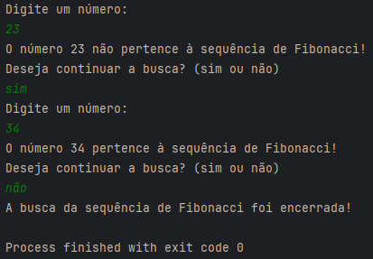
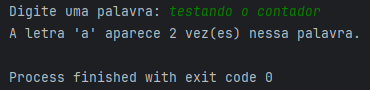
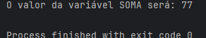
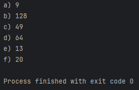
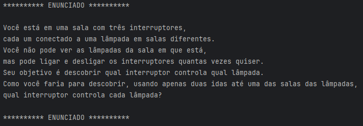
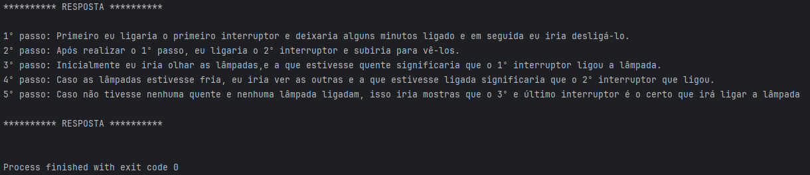

# 💼 Desafio Target 💼

### Desafio proposto pela empresa Target Sistemas 💻
### [@Target Sistemas](https://www.targetsistemas.com.br/)

---
## Indíce:

> - [Exercício 1](#exercício-1)
> - [Exercício 2](#exercício-2)
> - [Exercício 3](#exercício-3)
> - [Exercício 4](#exercício-4)
> - [Exercício 5](#exercício-5)

---
### Exercício 1:
- _Sequência de Fibonacci._
- _Inicia por 0 e 1 e o próximo valor será sempre a soma dos 2 valores anterioes._
- _(exemplo: 0, 1, 1, 2, 3, 5, 8, 13, 21, 34...)._

> 

### Exercício 2:
- _Aplicação que ao inserir uma palavra, ele contará quantos `a` tem em sua palavra e retornar esse valor para o usuário._

> 

### Exercício 3:
- _Aplicação que retornasse o valor da variável SOMA._
- _int INDICE = 12, SOMA = 0, K = 1; enquanto K < INDICE faça { K = K + 1; SOMA = SOMA + K; } imprimir(SOMA);_

> 

### Exercício 4:
- _Descobrir a lógica de cada elemento._
- _Descubra a lógica e complete o próximo elemento:_
- a) 1, 3, 5, 7, ___
- b) 2, 4, 8, 16, 32, 64, ____
- c) 0, 1, 4, 9, 16, 25, 36, ____
- d) 4, 16, 36, 64, ____
- e) 1, 1, 2, 3, 5, 8, ____
- f) 2,10, 12, 16, 17, 18, 19, ____

> 

### Exercício 5:

> 

> 